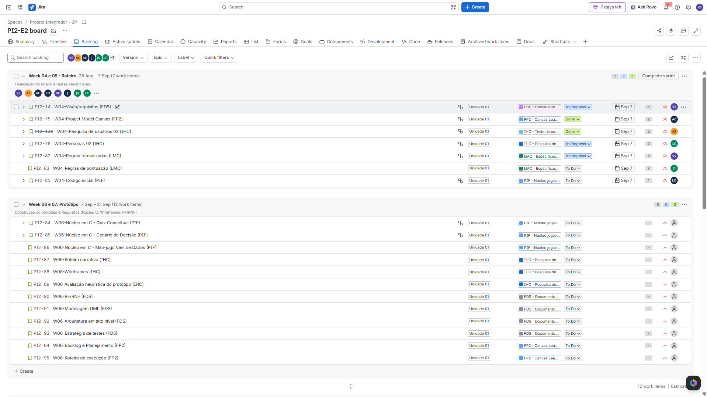

# 🎮 [NOME DO PROJETO]

<p align="center">
  
</p>

<p align="center">
  <strong>[SLOGAN OU FRASE CURTA DO PROJETO — OPCIONAL]</strong>
</p>

## 📖 Sobre o Projeto

**[NOME DO PROJETO]** é um projeto desenvolvido por estudantes de **[CURSO]**, da **[INSTITUIÇÃO]**, como parte da disciplina/projeto **[NOME DA DISCIPLINA OU PROJETO INTEGRADOR]**.

O projeto consiste em **[EXPLIQUE EM 2–4 FRASES O QUE ESTÁ SENDO DESENVOLVIDO, QUAL É A IDEIA PRINCIPAL E PARA QUEM O PRODUTO É DESTINADO]**.

Nosso objetivo é **[OBJETIVO PRINCIPAL DO PROJETO]**.

---

## 🎯 Objetivo

[DESCREVA BREVEMENTE O QUE O GRUPO PRETENDE ALCANÇAR COM O PROJETO.]

### Objetivos específicos

* [OBJETIVO 1]
* [OBJETIVO 2]
* [OBJETIVO 3]
* [OBJETIVO 4]

---

## 🎮 Sobre o Jogo

**Gênero:** [VISUAL NOVEL / RPG DE ESCOLHAS / OUTRO]

**Tema:** [TEMA]

**Ambientação:** [QUANDO E ONDE O JOGO SE PASSA]

**Público-alvo:** [PÚBLICO]

**Duração estimada:** [DURAÇÃO]

### Sinopse

[ESCREVA AQUI UMA SINOPSE CURTA DO JOGO. EXPLIQUE A PREMISSA SEM PRECISAR CONTAR TODA A HISTÓRIA.]

---

## ✨ Principais Funcionalidades

O projeto prevê as seguintes funcionalidades:

* 🎭 [FUNCIONALIDADE 1]
* 💬 [FUNCIONALIDADE 2]
* 🎮 [FUNCIONALIDADE 3]
* 🖼️ [FUNCIONALIDADE 4]
* 🎵 [FUNCIONALIDADE 5]
* 💾 [FUNCIONALIDADE 6]

---

## ⚙️ Tecnologias e Ferramentas

Para o desenvolvimento e gerenciamento do projeto, utilizamos:

* **C** — [EXPLIQUE COMO/ONDE É UTILIZADO];
* **Raylib** — [EXPLIQUE COMO/ONDE É UTILIZADA];
* **Figma** — [EXPLIQUE COMO/ONDE É UTILIZADO];
* **GitHub** — utilizado para versionamento, armazenamento e colaboração no código do projeto;
* **[JIRA / TRELLO / GITHUB PROJECTS]** — utilizado para organização das tarefas, backlog e acompanhamento do desenvolvimento;
* **[OUTRA FERRAMENTA]** — [FINALIDADE].

---

## 🎨 Protótipo

O protótipo das interfaces do projeto pode ser acessado abaixo:

🔗 **[LINK PARA O FIGMA OU PROTÓTIPO]**

### Tela Inicial

<p align="center">
  
</p>

### [NOME DE OUTRA TELA]

<p align="center">
  
</p>

> As interfaces apresentadas podem sofrer alterações durante o desenvolvimento do projeto.

---

# 📊 Gestão do Projeto

## 📋 Project Board

O desenvolvimento do projeto é acompanhado por meio de **[NOME DA FERRAMENTA]**, permitindo visualizar as tarefas planejadas, em andamento e concluídas pela equipe.

🔗 **[LINK PARA O BOARD]**

### Board atualizado

<p align="center">
  
</p>

**Última atualização:** [DD/MM/AAAA]

---

## 📝 Backlog

O backlog reúne as funcionalidades, requisitos e tarefas planejadas para o desenvolvimento do projeto.

🔗 **[LINK PARA O BACKLOG, SE HOUVER]**

### Backlog atualizado

<p align="center">
  
</p>

**Última atualização:** [DD/MM/AAAA]

---

## 🚀 Status do Projeto

### ✅ Concluído

* [ITEM CONCLUÍDO]
* [ITEM CONCLUÍDO]
* [ITEM CONCLUÍDO]

### 🔄 Em desenvolvimento

* [ITEM EM DESENVOLVIMENTO]
* [ITEM EM DESENVOLVIMENTO]

### ⏳ Próximas etapas

* [PRÓXIMA ETAPA]
* [PRÓXIMA ETAPA]
* [PRÓXIMA ETAPA]

---

# 👥 Equipe

| Integrante   | Papel no Projeto | Principais Responsabilidades |
| ------------ | ---------------- | ---------------------------- |
| **[NOME 1]** | [PAPEL]          | [RESPONSABILIDADES]          |
| **[NOME 2]** | [PAPEL]          | [RESPONSABILIDADES]          |
| **[NOME 3]** | [PAPEL]          | [RESPONSABILIDADES]          |
| **[NOME 4]** | [PAPEL]          | [RESPONSABILIDADES]          |
| **[NOME 5]** | [PAPEL]          | [RESPONSABILIDADES]          |

### Perfis

* 👤 **[NOME 1]** — [GitHub]([LINK]) | [LinkedIn]([LINK])
* 👤 **[NOME 2]** — [GitHub]([LINK]) | [LinkedIn]([LINK])
* 👤 **[NOME 3]** — [GitHub]([LINK]) | [LinkedIn]([LINK])
* 👤 **[NOME 4]** — [GitHub]([LINK]) | [LinkedIn]([LINK])
* 👤 **[NOME 5]** — [GitHub]([LINK]) | [LinkedIn]([LINK])

---

## 📁 Organização do Repositório

```text
📦 projeto
 ┣ 📂 assets
 ┃ ┣ 📂 evidencias
 ┃ ┃ ┣ 📜 board.png
 ┃ ┃ ┗ 📜 backlog.png
 ┃ ┣ 📂 screenshots
 ┃ ┗ 📜 logo.png
 ┣ 📂 src
 ┃ ┗ 📜 [ARQUIVOS DO CÓDIGO]
 ┣ 📜 README.md
 ┗ 📜 [OUTROS ARQUIVOS]
```

---

## 📌 Evidências do Desenvolvimento

| Evidência                          |    Status    |
| ---------------------------------- | :----------: |
| Repositório público                |       ✅      |
| README organizado                  |       ✅      |
| Papéis dos integrantes registrados |       ✅      |
| Board atualizado                   |       ✅      |
| Backlog atualizado                 |       ✅      |
| Protótipo                          | [✅ / 🔄 / ⏳] |
| Implementação                      | [✅ / 🔄 / ⏳] |
| Testes                             | [✅ / 🔄 / ⏳] |

---

## 🔗 Links Importantes

* 🎨 **Figma:** [LINK]
* 📋 **Board:** [LINK]
* 📝 **Backlog:** [LINK]
* 💻 **Repositório:** [LINK]
* 🌐 **Landing Page:** [LINK, SE HOUVER]
* 📄 **Documentação:** [LINK, SE HOUVER]

---

<p align="center">
  Desenvolvido pela equipe <strong>[NOME DA EQUIPE]</strong> ❤️
</p>

<p align="center">
  [CESAR SCHOOL] • [ADS] • [2026]
</p>
