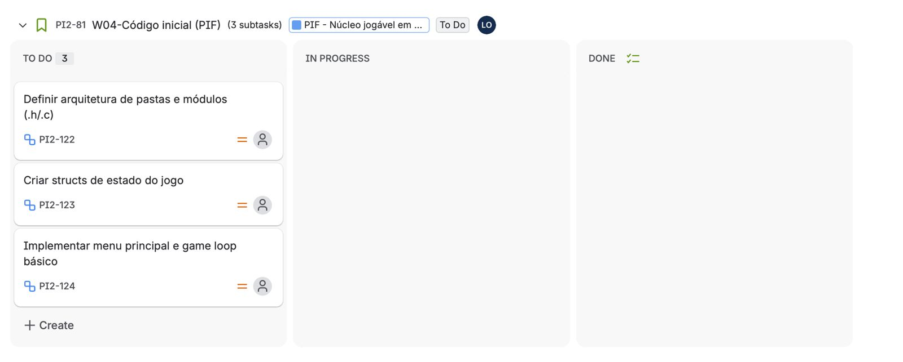
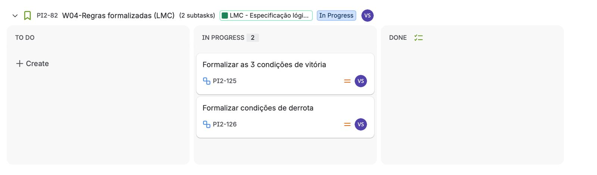
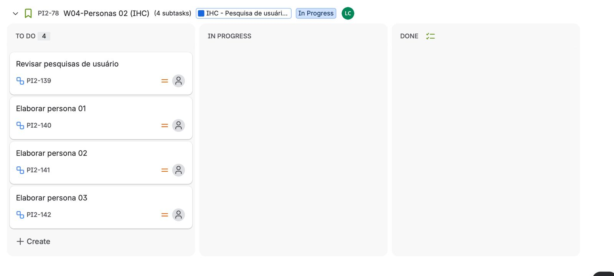
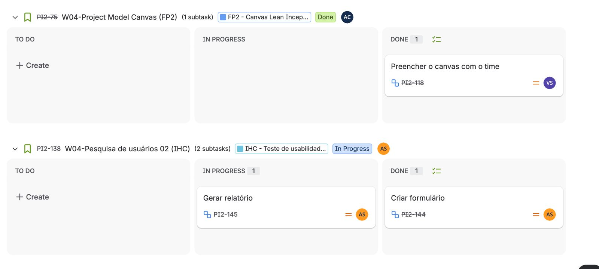
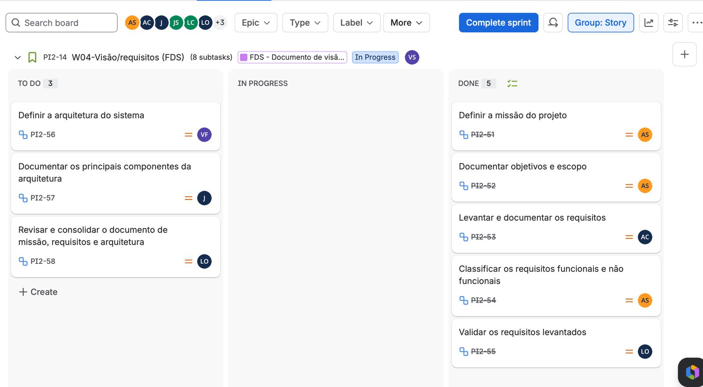
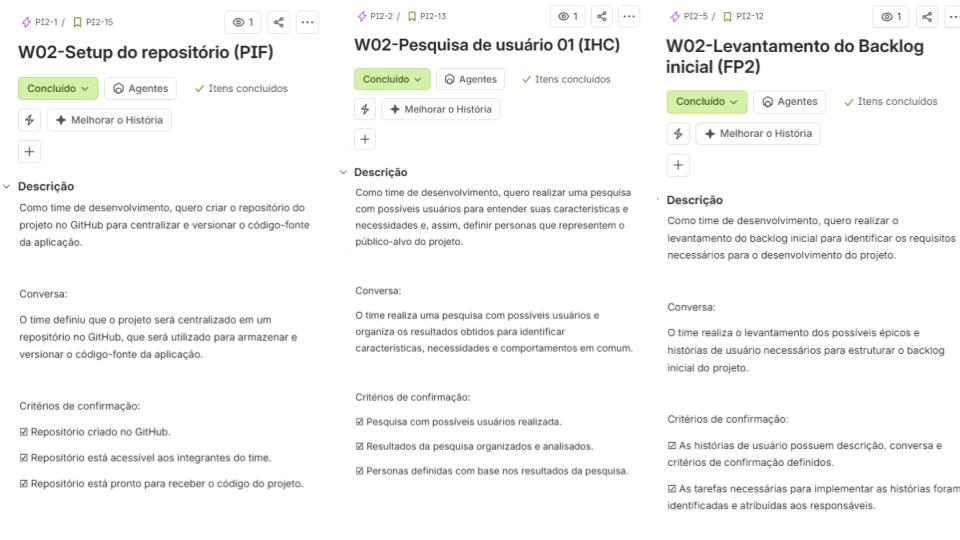

# 🎮 [PROJETO INTEGRADOR - TEAM 2]

<p align="center">
  <strong>2007 ligou. você vai atender?</strong>
</p>

## 📖 Sobre o Projeto

**Re:2007** é um projeto desenvolvido por estudantes do segundo período de **ADS**, da **CESAR SCHOOL**, como parte de um projeto integrador que visa utilizar conhecimentos de todas as cadeiras simultaneamente.

O projeto consiste no desenvolvimento de uma visual novel interativa em linguagem C, na qual o jogador acompanha uma personagem adulta que, com a intervenção de uma Inteligência Artificial, é transportada de volta para 2007 e precisa lidar novamente com situações e escolhas de sua adolescência. A proposta combina narrativa interativa, tomada de decisões e elementos visuais inspirados na estética digital dos anos 2000, buscando dialogar tanto com pessoas que vivenciaram esse período quanto com uma geração mais jovem familiarizada com o retorno da estética Y2K.

Nosso objetivo é desenvolver uma experiência narrativa interativa que explore, de forma lúdica, a relação entre tecnologia, escolhas e diferentes perspectivas geracionais, aplicando os conhecimentos de programação e desenvolvimento de software trabalhados ao longo do Projeto Integrador.

---

## 🎯 Objetivo

Desenvolver um jogo educativo de escolhas e consequências voltado ao letramento crítico em Inteligência Artificial.

### Objetivos específicos

* Desenvolver um jogo educativo sobre letramento em IA, baseado em escolhas e consequências.
* Entregar um jogo funcional e validá-lo por meio de testes com usuários.
* Criar um MVP compatível com o conhecimento da equipe, o prazo e as tecnologias disponíveis.
* Promover a compreensão crítica sobre o uso, funcionamento, limites e riscos da IA.
* Concluir e validar o jogo até o final do semestre, em aproximadamente 4 meses.

---

## 🎮 Sobre o Jogo

**Gênero:** VISUAL NOVEL / RPG DE ESCOLHAS / OUTRO

**Tema:** Letramento em Inteligência Artificial, uso crítico da tecnologia e tomada de decisões.

**Ambientação:** 2007, em uma representação inspirada na cultura, tecnologia e estética digital dos anos 2000.

**Público-alvo:** Adolescentes e jovens adultos, incluindo tanto usuários familiarizados com ferramentas de IA quanto pessoas com pouco conhecimento sobre seu funcionamento, limites e riscos.

**Duração estimada:** Aproximadamente 6 minutos para o MVP.

### Sinopse

Após uma interação inesperada com uma Inteligência Artificial, uma mulher adulta é transportada de volta para 2007, período em que ainda era adolescente. Para encontrar uma forma de retornar ao presente, ela deverá enfrentar situações e desafios com a ajuda de uma IA que parece saber mais do que deveria.

Ao longo da história, o jogador deverá tomar decisões, solucionar desafios e interagir com diferentes recursos de Inteligência Artificial. Suas escolhas permitem explorar, de forma lúdica, possibilidades, limitações e riscos relacionados ao uso dessas tecnologias.

---

## ✨ Principais Funcionalidades

O projeto prevê as seguintes funcionalidades:

* 💬 **Sistema de diálogos:** progressão da narrativa por meio de diálogos entre personagens e interação com a IA.

* 🔀 **Sistema de escolhas e consequências:** decisões tomadas pelo jogador podem alterar diálogos, acontecimentos e o desenvolvimento da narrativa.

* 🧩 **Minijogos e desafios interativos:** atividades integradas à história que apresentam diferentes situações relacionadas ao uso e funcionamento da Inteligência Artificial.

* 🤖 **Interações voltadas ao letramento em IA:** situações que abordam possibilidades, limitações e riscos da tecnologia dentro do contexto da narrativa.

* 🖥️ **Ambientação inspirada em 2007:** cenários e interfaces baseados na estética, cultura e tecnologias digitais dos anos 2000.

* 📊 **Feedback das decisões:** apresentação das consequências das escolhas e do desempenho nos desafios, incentivando a reflexão sobre as decisões tomadas.

---

## ⚙️ Tecnologias e Ferramentas

Para o desenvolvimento e gerenciamento do projeto, utilizamos:

* **C** — linguagem de programação utilizada para o desenvolvimento da lógica e das funcionalidades do jogo;
* **Raylib** — biblioteca utilizada para o desenvolvimento da interface gráfica, gerenciamento de imagens, textos, áudio e interações do jogo;
* **Figma** — utilizado para prototipação das interfaces e definição da identidade visual do jogo;
* **GitHub** — utilizado para versionamento, armazenamento e colaboração no código do projeto;
* **Jira** — utilizado para organização das tarefas, gerenciamento do backlog e acompanhamento do desenvolvimento;
* **Canva** — utilizado para criação de elementos gráficos e materiais visuais do projeto.

---

## 🎨 Protótipo

O protótipo das interfaces do projeto pode ser acessado abaixo:

🔗 **[LINK PARA O FIGMA OU PROTÓTIPO]**

### Tela Inicial

<p align="center">
  
</p>

### [NOME DE OUTRA TELA]

<p align="center">
  
</p>

> As interfaces apresentadas podem sofrer alterações durante o desenvolvimento do projeto.

---

# 📊 Gestão do Projeto

## 📋 Project Board

O desenvolvimento do projeto é acompanhado por meio do Jira, permitindo visualizar as tarefas planejadas, em andamento e concluídas pela equipe.

🔗 **[https://csprj-adsr-2p-e2.atlassian.net/jira/software/c/projects/PI2/boards/2?atlOrigin=eyJpIjoiY2Q5MWJiYWI5MDcyNGUwZjlmNzk0YjQyNzQ3NjRhZjYiLCJwIjoiaiJ9]**

### Board atualizado
<p align="center">
  
</p>
<p align="center">
  
</p>
<p align="center">
  
</p>
<p align="center">
  
</p>
<p align="center">
  
</p>


### Histórias de Usuário 

<p align="center">
  
</p>
<p align="center">
  
</p>
<p align="center">
  
</p>
<p align="center">
  
</p>
<p align="center">
  
</p>


**Última atualização:** [DD/MM/AAAA]

---

## 📝 Backlog

O backlog reúne as funcionalidades, requisitos e tarefas planejadas para o desenvolvimento do projeto.

🔗 **[LINK PARA O BACKLOG, SE HOUVER]**

### Backlog atualizado

<p align="center">
 
</p>

**Última atualização:** [DD/MM/AAAA]

---

## 🚀 Status do Projeto

### ✅ Concluído

* [ITEM CONCLUÍDO]
* [ITEM CONCLUÍDO]
* [ITEM CONCLUÍDO]

### 🔄 Em desenvolvimento

* [ITEM EM DESENVOLVIMENTO]
* [ITEM EM DESENVOLVIMENTO]

### ⏳ Próximas etapas

* [PRÓXIMA ETAPA]
* [PRÓXIMA ETAPA]
* [PRÓXIMA ETAPA]

---

# 👥 Equipe

| Integrante   | Papel no Projeto | Principais Responsabilidades |
| ------------ | ---------------- | ---------------------------- |
| Aline Santos | [GAME DESIGNER]          | [UX/UI e Narrativa]          |
| Ana Rita Correia | [PRODUCT OWNER]          | [visão do produto e priorização do backlog.]|
| Gabriel Farias | [DESENVOLVEDOR]          | [desenvolvimento e implementação do produto.]          |
| Juan Nunes | [DESENVOLVEDOR]          | [desenvolvimento e implementação do produto.]          |
| Juliana Freire | [SCRUM MASTER]          | [organização do fluxo e acompanhamento das tarefas]|
| Leandro Luís | [DESENVOLVEDOR]          | [Q/A e Testes]          |
| Luiz Mario | [DESENVOLVEDOR]          | [desenvolvimento e implementação do produto.]          |
| Vinícius Lino | [DESENVOLVEDOR]          | [desenvolvimento e implementação do produto.]          |
| Vitória Santos | [GAME DESIGNER]          | [UX/UI e Narrativa]          |

### Perfis

* 👤 **[NOME 1]** — [GitHub]([LINK]) | [LinkedIn]([LINK])
* 👤 **[NOME 2]** — [GitHub]([LINK]) | [LinkedIn]([LINK])
* 👤 **[NOME 3]** — [GitHub]([LINK]) | [LinkedIn]([LINK])
* 👤 **[NOME 4]** — [GitHub]([LINK]) | [LinkedIn]([LINK])
* 👤 **[NOME 5]** — [GitHub]([LINK]) | [LinkedIn]([LINK])

---

## 📁 Organização do Repositório

```text
📦 projeto
 ┣ 📂 assets
 ┃ ┣ 📂 evidencias
 ┃ ┃ ┣ 📜 board.png
 ┃ ┃ ┗ 📜 backlog.png
 ┃ ┣ 📂 screenshots
 ┃ ┗ 📜 logo.png
 ┣ 📂 src
 ┃ ┗ 📜 [ARQUIVOS DO CÓDIGO]
 ┣ 📜 README.md
 ┗ 📜 [OUTROS ARQUIVOS]
```

---

## 📌 Evidências do Desenvolvimento

| Evidência                          |    Status    |
| ---------------------------------- | :----------: |
| Repositório público                |       ✅      |
| README organizado                  |       ✅      |
| Papéis dos integrantes registrados |       ✅      |
| Board atualizado                   |       ✅      |
| Backlog atualizado                 |       ✅      |
| Protótipo                          | [✅ / 🔄 / ⏳] |
| Implementação                      | [✅ / 🔄 / ⏳] |
| Testes                             | [✅ / 🔄 / ⏳] |

---

## 🔗 Links Importantes

* 🎨 **Figma:** [LINK]
* 📋 **Board:** [LINK]
* 📝 **Backlog:** [LINK]
* 💻 **Repositório:** [LINK]
* 🌐 **Landing Page:** [LINK, SE HOUVER]
* 📄 **Documentação:** [LINK, SE HOUVER]

---

<p align="center">
  Desenvolvido pela <strong> equipe 2 </strong> 
</p>

<p align="center">
  [CESAR SCHOOL] • [ADS] • [2026]
</p>
